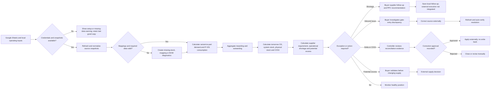

# Chakra Module Profile — Inventory Management Agent

## Evidence and status convention

This profile describes the repository as inspected on branch `abhiraj-work` at commit `d2a4ff0e6d97e57193119ea49ba884b5efd03278`. It does not treat code presence as production evidence.

Status terms used throughout:

- **Working locally** — reachable in the active Streamlit application and supported by executable code, but no hosted production environment is evidenced.
- **Partial** — some workflow behavior is executable, while identity, external delivery, approval enforcement, write-back or required data is missing.
- **Prototype / unrouted** — code or a script exists, but it is not connected to the active user flow or scheduler.
- **Missing** — the repository contains no implementation.
- **Unknown** — repository evidence cannot establish the fact. **Requires team confirmation.**

Primary evidence is the monolithic Streamlit application in `app.py`, supplemented by `README.md`, `requirements.txt`, `.streamlit/`, the GRN script and SQL files, and tracked sample/configuration data. Runtime CSV snapshots observed locally are evidence of local execution only, not production deployment.

---

## 1. Platform identity

| Field | Finding | Repository evidence |
|---|---|---|
| Platform name | Inventory Management Agent; active UI brand: InventoryOS | `app.py:22`, `app.py:11698-11715` |
| Repository | `inventory-management-agent` | Git remote and repository directory |
| Owning team | Requires team confirmation. The workflow language suggests SCM/plant materials, but no owner is named. | No owner declaration in `README.md` or code |
| Business owner | Requires team confirmation. | Not found |
| Technical owner | Requires team confirmation. | Not found |
| Primary users | SCM buyers, plant-material controllers, stores/inwarding users, PPC/production-control users | Active workspaces and labels at `app.py:4627-4864`, `5334-5470`, `6961-7634`, `8270-8559`, `9774-10106` |
| Secondary users | SCM/plant leadership, master-data administrators and auditors | Overview/audit functions at `app.py:3439-3613`, `5616-5858` |
| Environment | **Localhost only**; no staging or production deployment is evidenced | `README.md`; no Docker, hosting or deployment manifest |
| Maturity | **Working local MVP**; pilot acceptance and production use require team confirmation | Active Streamlit routes at `app.py:11710-11964`; no tests, CI or deployment |
| Description | A plant-material control workspace that combines production plans, BOM consumption, stock snapshots, inbound receipts, buyer ownership and supplier follow-up into daily inventory decisions. | Calculation and workflow functions throughout `app.py` |
| Intended outcome | Protect planned production from material shortages while identifying possible excess and maintaining exception evidence. | Requirements, excess, inwarding and audit functions |
| Problem addressed | Disconnected spreadsheet inputs make it difficult to determine material availability, ownership, supplier action and movement discrepancies end to end. | Read-only source registry and joined calculations at `app.py:50-99`, `2376-3170` |

### Operating cadence and horizon

- **Cadence:** daily, intraday and ad hoc.
- **Refresh:** manual, plus an optional 15-minute refresh while an enabled Streamlit session remains open (`app.py:10998-11041`). This is not a durable background scheduler.
- **Planning horizons:** current day, rolling seven days and remaining month (`app.py:2991-3170`, `5334-5470`).
- **Granularity:** plant/HS01, part/material, supplier, buyer, variant, finished-good code, vehicle/VIN, gate entry, invoice and PO.
- Real-time or event-driven operation is **not implemented**.

---

## 2. Recommended Chakra position

### Recommended L0 block

**Daily Operations**

### Alternative L0 block

**Plant Materials Control**

### Purpose

Coordinate daily plant-material availability, receipts, consumption, exceptions and accountable action against production execution.

This should not become a new peer to enterprise planning or logistics if Chakra already has a broader Daily Operations block. It belongs inside that block as the material-control capability.

### L1 modules

1. Data Intake and Readiness
2. Inventory Position and Reconciliation
3. Material Requirements and Supplier Control
4. Inbound Materials Control
5. Production Consumption and Outwarding

### L2 workflows

| L1 module | L2 workflow | L4 supporting evidence |
|---|---|---|
| Data Intake and Readiness | W1 Refresh and retain source snapshots | `app.py:911-1112`, `10868-11041`, `.streamlit/secrets.toml.example` |
| Data Intake and Readiness | W2 Optional GRN data export | `scripts/scheduled_grn_export.py`, `config/grn_export.env.example`, `sql/`; active app routing absent |
| Inventory Position and Reconciliation | W3 Calculate daily inventory position | `app.py:1975-2042`, `2215-2736`, `3183-3214`, `4024-4626`, `5029-5333` |
| Inventory Position and Reconciliation | W4 Investigate and record inventory corrections | `app.py:2761-2895`, `5484-5858` |
| Material Requirements and Supplier Control | W5 Plan shortage coverage and supplier follow-up | `app.py:2739-2758`, `2926-3170`, `4627-4864`, `5334-5470`, `6941-7634` |
| Material Requirements and Supplier Control | W6 Screen potential excess | `app.py:3329-3438`, `5884-6072` |
| Inbound Materials Control | W7 Refresh and review inwarding | `app.py:804-909`, `8246-8559` |
| Inbound Materials Control | W8 Resolve inwarding discrepancies | `app.py:8840-9335`, `9774-10106` |
| Production Consumption and Outwarding | W9 Calculate variant and P-VIN material consumption | `app.py:1115-1974`, `2043-2375`, `3614-4626` |
| Production Consumption and Outwarding | W10 Calculate and review daily outwarding | `app.py:1552-1839`, `8560-8839` |

---

## 3. Module hierarchy

### L0: Daily Operations

#### L1: Data Intake and Readiness

**Purpose:** acquire, retain and assess source data.  
**Primary user:** application operator/plant-material controller.  
**Cadence:** manual or every 15 minutes while a session is open.  
**Current status:** Google Sheets workflow works locally; GRN export is an unrouted prototype.

##### L2 W1: Refresh and retain source snapshots

- **Start trigger:** manual master refresh or enabled in-session interval.
- **End condition:** available sources have saved local snapshots; failed sources retain their previous copy.
- **Primary output:** local CSV snapshots and refresh diagnostics.
- **L3 steps:**
  1. Authorize read-only Google Sheets access.
  2. Fetch configured production, BOM, stock, inwarding and mapping sources.
  3. Normalize and atomically save local snapshots.
  4. Recompute dependent inventory, usage and discrepancy views.
  5. Report partial failures without deleting the last good copy.
- **L4:** `app.py:46-99`, `911-1112`, `10868-11041`.

##### L2 W2: Optional GRN data export

- **Start trigger:** a technical operator runs the script; no repository scheduler exists.
- **End condition:** deduplicated CSV and metadata are saved, or the script exits with an error.
- **Primary output:** local GRN data.
- **L3 steps:**
  1. Read Trino/Superset environment configuration.
  2. Run the SQL or Superset API request.
  3. Validate expected columns.
  4. Deduplicate and write atomically.
- **L4:** `scripts/scheduled_grn_export.py`, `config/grn_export.env.example`, `sql/`.

#### L1: Inventory Position and Reconciliation

**Purpose:** calculate stock position and expose evidence for inventory exceptions.  
**Primary user:** plant-material controller and auditor.  
**Cadence:** daily/intraday.  
**Current status:** working locally; authoritative write-back and role enforcement are absent.

##### L2 W3: Calculate daily inventory position

- **Start trigger:** refreshed snapshots or edited variant operating inputs.
- **End condition:** part-level movement, stock, shortage and status fields exist.
- **Primary output:** part inventory position and stock-health queues.
- **L3 steps:**
  1. Match planned parts to exact SCM stock records.
  2. Aggregate selected-date inwarding and outwarding.
  3. Calculate generated and produced P-VIN component consumption.
  4. Calculate `Tomorrow OS = Today's OS + Inwarded − Outwarded`.
  5. Calculate system stock, physical stock and COGI.
  6. Calculate supplier requirement from system stock and operational shortage from physical stock.
  7. Classify stock health and unexplained deltas.
- **L4:** `app.py:1975-2042`, `2215-2736`, `3183-3214`, `5029-5333`.

##### L2 W4: Investigate and record inventory corrections

- **Start trigger:** a stock, movement or master-data exception is selected.
- **End condition:** evidence is reviewed and a correction decision is logged; source data remains unchanged.
- **Primary output:** reconciliation queue and local correction audit record.
- **L3 steps:**
  1. Review delta, COGI, duplicate, invoice/receipt or master-data evidence.
  2. Enter proposed value, reason, requester and approver.
  3. Save a pending request.
  4. Record Approved, Rejected or Applied externally.
  5. Apply any actual source correction outside the application.
- **L4:** `app.py:5484-5858`.

#### L1: Material Requirements and Supplier Control

**Purpose:** turn stock and demand into buyer-owned shortage or excess actions.  
**Primary user:** SCM buyer and PPC user.  
**Cadence:** daily/intraday.  
**Current status:** working locally; supplier communication, PO integration and enforced approvals are absent.

##### L2 W5: Plan shortage coverage and supplier follow-up

- **Start trigger:** current inventory calculation plus selected horizon.
- **End condition:** buyer saves a complete follow-up or handles the requirement externally.
- **Primary output:** supplier requirement, required-by date, buyer queue and action recommendation.
- **L3 steps:**
  1. Aggregate demand for Today, Rolling 7 Days or Remaining Month.
  2. Find the first date cumulative demand exceeds stock.
  3. Classify Critical, High or Medium.
  4. Filter by buyer and that buyer's suppliers.
  5. Capture supplier status, expected quantity, ETA, next follow-up and notes.
  6. Generate deterministic quantity/timing/PPC action bullets.
  7. Save the follow-up locally.
- **L4:** `app.py:2926-3170`, `4627-4864`, `5334-5470`, `6941-7634`.

##### L2 W6: Screen potential excess

- **Start trigger:** user selects Potential excess and a horizon.
- **End condition:** potential signals are reviewed; no supply commitment changes automatically.
- **Primary output:** indicative buyer-owned excess queue.
- **L3 steps:**
  1. Aggregate selected-horizon demand.
  2. Compare it with physical stock.
  3. Flag possible excess.
  4. Require human validation because open POs, lead time and safety stock are absent.
- **L4:** `app.py:3329-3438`, `5884-6072`.

#### L1: Inbound Materials Control

**Purpose:** fact-check direct gate entries and keep buyer-owned discrepancy cases.  
**Primary user:** stores/inwarding user and SCM buyer.  
**Cadence:** intraday/ad hoc.  
**Current status:** working locally from saved sheets; no source write-back or notification.

##### L2 W7: Refresh and review inwarding

- **Start trigger:** manual inwarding refresh or master refresh.
- **End condition:** valid snapshot is saved and filterable.
- **Primary output:** buyer-enriched gate-entry view.
- **L3 steps:**
  1. Read Direct Gate Entry and buyer mapping.
  2. Clean and cache the data.
  3. Map buyer by part, then supplier fallback.
  4. Filter by date, gate entry, part, buyer, supplier and unloading state.
  5. Show mapping coverage and permit CSV download.
- **L4:** `app.py:8246-8559`.

##### L2 W8: Resolve inwarding discrepancies

- **Start trigger:** refreshed snapshot reconciliation.
- **End condition:** source evidence is clean and the case is auto-resolved, or it remains assigned.
- **Primary output:** persistent buyer issue queue and audit history.
- **L3 steps:**
  1. Detect quantity, ownership, required-field, unloading and duplicate issues.
  2. Assign severity, age, production risk and escalation.
  3. Assign buyer or SCM Admin fallback.
  4. Record Acknowledged, Investigating or Awaiting source correction.
  5. Auto-resolve only when refreshed source evidence removes the issue.
  6. Reopen if the issue recurs.
- **L4:** `app.py:8886-9335`, `9774-10106`.

#### L1: Production Consumption and Outwarding

**Purpose:** translate variant/vehicle execution through the BOM into component use.  
**Primary user:** PPC user and plant-material controller.  
**Cadence:** daily/intraday.  
**Current status:** working locally; ERP/MES transaction posting is absent.

##### L2 W9: Calculate variant and P-VIN material consumption

- **Start trigger:** production, P-VIN, mapping or BOM data changes.
- **End condition:** variant totals and part-level generated/produced consumption are recalculated.
- **Primary output:** variant operating table and part consumption.
- **L3 steps:**
  1. Parse plan and production break-up.
  2. Apply saved editable variant operating values.
  3. Map variants to FG codes.
  4. Explode FG quantities through the BOM.
  5. Feed generated and produced consumption into all dependent inventory calculations.
- **L4:** `app.py:1115-1974`, `2043-2375`, `3614-4626`.

##### L2 W10: Calculate and review daily outwarding

- **Start trigger:** source refresh or saved Outwarding page load.
- **End condition:** daily part usage is calculated, filtered and optionally downloaded.
- **Primary output:** production-used, servicing/manual-used and total outwarding quantity.
- **L3 steps:**
  1. Build exact FG production by date.
  2. Multiply output by BOM usage.
  3. Aggregate component consumption.
  4. Combine any manual outwarding data present.
  5. Report unmapped production and missing BOM.
  6. Export filtered usage when requested.
- **L4:** `app.py:1552-1839`, `8560-8839`.

---

## 4. End-to-end business flow

### A. Simple business flow

Source spreadsheets and local operating inputs  
→ read-only authorization and snapshot retention  
→ source/BOM/stock/mapping validation  
→ variant-to-part demand and P-VIN consumption  
→ inwarding and outwarding aggregation  
→ system/physical stock and requirement calculation  
→ shortage, excess, discrepancy and reconciliation decisions  
→ buyer/controller/PPC human action  
→ local follow-up or approval record  
→ refreshed source evidence or external execution  
→ verification where implemented.

Important limitations:

- Supplier messages, purchase-order changes, PPC plan changes and stock write-back are not executed by the platform.
- Inwarding issue closure is verified by refreshed source evidence.
- Correction “approval” is only a local record; application of the correction is external.
- Supplier delivery and PPC execution verification are not integrated.

### B. Mermaid flowchart



---

## 5. Capability inventory

The machine-readable file contains the full field set for each capability. This table is the business-facing summary.

| ID | Capability | L1 / L2 | User action | Mode | Input → output | Permission / approval | Status | Repository evidence |
|---|---|---|---|---|---|---|---|---|
| C01 | Connect read-only Google Sheets | M1 / W1 | Authorize account | Manual + token refresh | OAuth consent → local credentials | Sheets readonly / Google consent | Working locally | `app.py:46-49`, `911-1029` |
| C02 | Refresh all source sheets | M1 / W1 | Click master refresh | Automated fetch/cache | Sheets → local snapshots | Viewer access / none | Working locally | `app.py:10868-10995` |
| C03 | Auto-refresh every 15 minutes | M1 / W1 | Enable toggle, keep session open | In-session timer | Sources → snapshots | Viewer access / none | Working locally, session-limited | `app.py:10998-11041` |
| C04 | Retain snapshots on failure | M1 / W1 | Review warning | Atomic cache rule | Failed response → previous copy | Local FS / none | Working locally | `app.py:1102-1112`, `10868-10995` |
| C05 | Export GRN data | M1 / W2 | Run CLI script | Script | Trino/Superset → CSV/meta | External credentials / unknown | Prototype, unrouted/unscheduled | `scripts/scheduled_grn_export.py` |
| C06 | Edit variant operating inputs | M5 / W9 | Edit and save table | Manual + recalc | Values → local override | No role control / none | Working locally | `app.py:2043-2135`, `3614-4626` |
| C07 | Map variants to parts through BOM | M5 / W9 | Review impact | Deterministic | Variant/FG/BOM → component demand | Source view / none | Working locally | `app.py:1115-1285`, `2215-2375` |
| C08 | Calculate generated/produced P-VIN use | M5 / W9 | Enter/refresh P-VIN | Deterministic | P-VIN × BOM → part consumption | No role control / none | Working locally; source of truth unknown | `app.py:2215-2375` |
| C09 | Calculate daily outwarding | M5 / W10 | Refresh/filter/download | Deterministic | Actual FG × BOM → daily usage | Viewer access / none | Working locally | `app.py:1552-1839`, `8560-8839` |
| C10 | Calculate movements and stock | M2 / W3 | Refresh/change input | Deterministic | OS/inward/outward → stock position | Source access / none | Working locally | `app.py:2376-2736` |
| C11 | Separate supplier vs operational shortage | M2 / W3 | Review evidence | Deterministic | Need/system/physical → two measures | None / none | Working locally | `app.py:2690-2725` |
| C12 | Classify stock health | M2 / W3 | Select queue | Rules | Inventory → status queues | None / none | Working locally | `app.py:3183-3214`, `5029-5333` |
| C13 | Reconcile COGI and deltas | M2 / W4 | Review evidence | Rules | Stock/inbound exceptions → queue | None / none | Working locally | `app.py:5484-5615` |
| C14 | Log correction requests | M2 / W4 | Submit/decide | Manual + persistence | Proposal → audit record | No auth / human status | Partial | `app.py:5700-5858` |
| C15 | Calculate horizon shortages | M3 / W5 | Select horizon | Rules | Demand/stock → required-by queue | None / none | Working locally | `app.py:2991-3170`, `5334-5470` |
| C16 | Filter buyer-owned supplier queues | M3 / W5 | Select buyer then supplier | Dependent filter | Ownership map → scoped queue | Not identity-based / none | Working locally | `app.py:4627-4864`, `5334-5470` |
| C17 | Record supplier follow-up | M3 / W5 | Complete and save action | Manual + validation | Commitment → local record | No auth / none enforced | Working locally | `app.py:2739-2758`, `6941-7634` |
| C18 | Recommend PPC/supplier response | M3 / W5 | Review bullets | Deterministic rules | Status/ETA/shortage → recommendation | None / external decision | Recommendation only | `app.py:2926-2988` |
| C19 | Screen potential excess | M3 / W6 | Select horizon/review | Indicative rules | Physical stock/demand → signal | None / external validation | Partial/indicative | `app.py:3329-3438`, `5884-6072` |
| C20 | Review/filter gate entries | M4 / W7 | Refresh/filter/download | Automated enrichment | Gate entry/map → view | Viewer access / none | Working locally | `app.py:8246-8559` |
| C21 | Detect inwarding discrepancies | M4 / W8 | Review queues | Rules engine | Inwarding → cases | None / none | Working locally | `app.py:8886-9134` |
| C22 | Manage issue follow-up | M4 / W8 | Acknowledge/investigate/note | Manual + persistence | Action input → updated case | Buyer selection, no auth / no manual resolve | Working locally | `app.py:9193-9335`, `9774-10106` |
| C23 | Auto-resolve/reopen issues | M4 / W8 | Refresh source | Lifecycle rules | Current/prior issues → status | Viewer access / source-verified | Working locally | `app.py:9137-9190` |
| C24 | Inspect master data/calculation evidence | M2 / W4 | Review diagnostics | Rules/read-only | Inventory → evidence queues | None / external correction | Diagnostic only | `app.py:5616-5699`, `6073-6940` |

---

## 6. Agents and automation

No LLM, generative-AI agent, forecasting model or optimization model is implemented. Names containing “Agent” are deterministic calculations, rules or work queues.

| Name | Type | Trigger | Decisions/actions | Human/approval | Failure/retry/escalation | Status and evidence |
|---|---|---|---|---|---|---|
| Master Source Refresh | Deterministic automation | Button or timer | Fetch, normalize, cache, retain old copy on failure | Operator authorizes | Partial failure shown; manual/next interval retry; no external escalation | Working locally, `app.py:10868-11041` |
| Inventory Calculation Engine | Deterministic calculation | App rerun | Movement, stock, COGI, shortage, delta | Human reviews | Diagnostics/empty views; rerun after correction | Working locally, `app.py:2376-2736` |
| Variant-to-Part Consumption Engine | Deterministic calculation | Production/P-VIN/BOM change | Map, explode, multiply, exclude unmapped | PPC reviews | Warnings; refresh after mapping correction | Working locally, `app.py:1115-2375` |
| Shortage Prevention Rules | Rules engine | Inventory/horizon view | Required-by date and severity | Buyer acts | Missing stock separated; no notification | Working locally, `app.py:2991-3170` |
| Supplier Recommendation Rules | Rules engine | Selected requirement/action | ETA, quantity and PPC bullets | Buyer/PPC decide externally | Required fields block save; no escalation | Working locally, not AI, `app.py:2926-2988` |
| Excess Prevention Rules | Indicative rules | Potential-excess view | Possible surplus | Buyer validates externally | PO/safety-stock limitation disclosed | Partial, `app.py:3329-3438`, `5884-6072` |
| Inwarding Discrepancy Rules | Rules engine | Snapshot reconciliation | Type, severity, owner, escalation | Buyer follows up; source verifies closure | Re-evaluate on refresh; UI escalation only | Working locally, `app.py:8886-9190` |
| Movement Reconciliation Rules | Rules engine | Audit view | Delta, COGI, duplicate, invoice/receipt queue | Controller investigates | Recommendation text only | Working locally, `app.py:5484-5615` |
| GRN Export Script | CLI integration script | Manual command | Query mode, validation, deduplication | Technical operator | Exits on error; no retry loop or scheduler | Prototype, `scripts/scheduled_grn_export.py` |

---

## 7. Human work

| Role | Inputs and decisions | Approval/task | Notification and non-response | Status |
|---|---|---|---|---|
| Application operator | OAuth and refresh decision; accepts/rejects stale/partial data operationally | Connect and refresh | In-app messages only; data becomes stale | Implemented without app identity |
| SCM buyer | Supplier status, quantity, ETA, follow-up, notes; chooses supplier response | Requirement/inwarding action; procurement authority requires confirmation | No notification; inwarding issue ages in UI | Partial |
| Stores/inwarding user | External gate-entry/receipt correction evidence | Fact-check and correct source externally | No notification; case remains/escalates in UI | Expected from workflow; identity not enforced |
| PPC/production control | Variant values and build context; plan-response decision | Plan adjustment is external | No notification/escalation | Partial |
| Correction requester | Proposed value, evidence, identity text | Raises request | None | Implemented without authentication |
| Correction approver | Reviews proposal | Records Approved/Rejected/Applied externally | No reminder; request stays pending | Partial; no permission/write-back |
| SCM/plant management | Metrics and exception queues | Prioritization; no formal approval flow | No notification | Expected consumer |

### Human wait states

1. OAuth consent before fresh source access.
2. Buyer commitment/ETA entry before supplier action can be saved.
3. Buyer or stores correction before an inwarding issue can disappear from source.
4. Correction approver decision.
5. External application of an approved correction.
6. External PPC decision on a recommended plan response.
7. External validation before reducing supply for potential excess.

Response-time SLAs, escalation owners and absence-handling policies mostly **require team confirmation**. Only inwarding age-based escalation rules are coded (`app.py:8925-8988`, `9079-9101`).

---

## 8. Exception handling

| Exception | Detection | Current response / user message | Retry / escalation | Owner | Blocks? | Status / evidence |
|---|---|---|---|---|---|---|
| OAuth missing/insufficient | Settings/credentials absent or API denies | Setup/connect warning; saved copy remains | Authorize/retry; no escalation | Operator | Blocks fresh data | Implemented, `app.py:911-1029`, `8270-8310` |
| Partial source failure | Per-source exception | Report failed sources; retain prior files | Manual/next session interval | Operator | May leave stale data | Implemented, `app.py:10868-10995` |
| Stale data | Snapshot time/file age | Freshness/attention status | Refresh; no external alert | Operator | No hard block | Partial, `app.py:11767-11918` |
| Missing/revision stock | Exact match fails | Missing/revision queue; blank not zero | Correct source and refresh | Requires confirmation | Affected calculation unreliable | Implemented, `app.py:2551-2595`, `3056-3088` |
| Unmapped variant/FG/BOM | Mapping lookup fails | Exclude and warn | Correct master data | PPC/master-data owner requires confirmation | Partial accuracy | Implemented, `app.py:1552-1839`, `8560-8839` |
| COGI/system posting failure | Generated use exceeds postable stock | Floor system stock at zero; separate COGI queue | External posting correction | Requires confirmation | Does not block physical shortage | Implemented, `app.py:2669-2675`, `5484-5615` |
| Unexplained stock delta | Delta rule | Delta review queue | Recount/posting review | Requires confirmation | No hard block | Implemented, `app.py:2690-2725` |
| Incomplete supplier action | Blank required fields | Disable save; list fields | User completes form | Buyer | Blocks local save | Implemented, `app.py:6961-7634` |
| Delayed supplier/late ETA | Status/date rule | PPC/supplier action recommendation | Human updates/acts | Buyer/PPC | No auto plan change | Partial, `app.py:2926-2988` |
| Potential excess false positive | Incomplete input set | Label indicative; disclose missing PO/safety stock | Validate externally | Buyer | Blocks safe auto-change | Partial, `app.py:5884-6072` |
| Invoice vs receipt conflict | Quantity mismatch | Buyer discrepancy case | Correct source/refresh | Buyer | No global block | Implemented, `app.py:8992-9031` |
| Missing inwarding owner/field | Blank buyer/PO/invoice/part/supplier | Case + SCM Admin fallback | Correct source/refresh | Buyer/admin | No global block | Implemented, `app.py:9033-9077` |
| Unloading overdue | Waiting + age | High/Critical case | Source update/refresh | Buyer | No global block | Implemented, `app.py:9079-9101` |
| Duplicate inwarding | Repeated gate/part/invoice key | Possible duplicate case | Verify source | Buyer | No global block | Implemented, `app.py:9103-9126` |
| Human non-response | Age only in some workflows | Issue remains visible | No notification or SLA worker | Requires confirmation | Can remain open indefinitely | Partial/unknown |
| Rejected correction | Status selected | Decision timestamp retained | New request is manual | Approver | Blocks that request | Record implemented, `app.py:5700-5858` |
| API timeout | Google/GRN client timeout | Exception shown or script exits | Manual retry; no backoff | Operator | Source-specific | Partial, `app.py:1044-1099`, GRN script |
| Database/model/notification/event failure | Components absent | No handling | None | Requires confirmation | Future integration | Missing |
| Workflow cancellation | No explicit state machine | Not implemented | None | Requires confirmation | Unknown | Missing |
| Failed downstream verification | Most outputs remain in-app/local | No supplier/PPC/ERP acknowledgement | None | Requires confirmation | Prevents closed loop | Missing |

---

## 9. Inputs, outputs and data ownership

### Inputs

| Input | Meaning/source | Format/frequency/granularity | Required fields | Freshness/source of truth | Unavailable behavior | Evidence |
|---|---|---|---|---|---|---|
| Production plan/breakup | Variant plan and operating values; Google Sheets | Sheet→CSV; daily/intraday; date+variant | Date, variant, plan | Current-day expected; authority requires confirmation | Prior copy/warning | `app.py:50-99`, `1294-1452` |
| VIN/production details | Actual FG/VIN production; Google Sheets | Sheet→CSV; intraday; VIN/FG/date | Identifier, date, status/qty | Requires confirmation | Saved copy or no output | `app.py:1453-1609` |
| Exploded/raw BOM | Component usage by FG; Sheets + HEADER supplement | Sheet/local CSV; FG+part | FG, part, usage qty | Authority/freshness require confirmation | Exclude and warn | `app.py:1115-1285`, `1611-1738` |
| SCM stock summary | System opening stock; SCM Summary sheet | Sheet→CSV; part/revision | Part, system OS | UI treats source-controlled; formal owner requires confirmation | Missing/revision queue | `app.py:1975-2042`, `2551-2595` |
| Direct Gate Entry | Supplier receipt/invoice/PO/unloading | Sheet→CSV; intraday; gate/invoice/part | Gate, date, supplier, part, invoice/receipt qty | Requires confirmation | Prior snapshot | `app.py:8270-8559` |
| Buyer/supplier mapping | Ownership assignment | Sheet→CSV; part/supplier | Part or supplier, buyer | Requires confirmation | Unmapped/SCM Admin fallback | `app.py:804-909`, `2597-2610` |
| Variant/P-VIN overrides | Human-entered local operating input | Local CSV; ad hoc; date+variant | Date, variant, numbers | Authority requires confirmation | Source/zero behavior by field | `app.py:2043-2135` |
| Supplier follow-up | Buyer commitment input | Local CSV; ad hoc; part/supplier | Status, qty, dates, owner, notes | By follow-up date; SLA requires confirmation | Save blocked | `app.py:2739-2758`, `6941-7634` |

### Outputs

| Output | Meaning / consumer | Format/frequency/granularity | Type | Integration and verification | Evidence |
|---|---|---|---|---|---|
| Part inventory position | Movement, stock, shortage, delta; controller/buyer/PPC | In-app; rerun; date+part | Operational calculation | No external sign-off | `app.py:2479-2736` |
| Supplier requirement queue | System-stock-based quantity/date; buyer | In-app; daily/intraday; part/supplier | Recommendation/work queue | No procurement transaction verification | `app.py:2991-3170`, `5334-5470` |
| Operational shortage queue | Physical-stock line risk; PPC/controller | In-app; daily/intraday; part | Exception | No line-event confirmation | `app.py:2690-2725`, `5029-5333` |
| Supplier follow-up | Commitment/ETA/next action | Local CSV; ad hoc; part/supplier | Commitment record/recommendation | No supplier acknowledgement | `app.py:2739-2758`, `6941-7634` |
| Potential excess | Indicative surplus | In-app; on demand; part | Draft signal | External validation required | `app.py:3329-3438`, `5884-6072` |
| Inwarding action queue | Buyer gate-entry cases | Local CSV/in-app; refresh; action/gate/part | Exception/action | Source refresh verifies closure | `app.py:8840-9335` |
| Daily outwarding | Component consumption | In-app/cache/download; daily; date+part | Calculated actual | No ERP posting verification | `app.py:8560-8839` |
| Correction decision log | Proposed correction + status | Local CSV; ad hoc; request | Approval record | Applied externally is manual | `app.py:5700-5858` |

### Shared identifiers

- **Part No.** — principal join across BOM, stock, mapping, inwarding and requirements; revision mismatch handling exists.
- **FG Code** — joins production/SKU to BOM.
- **Variant** — joins plan and P-VIN input to FG allocation.
- **VIN** — identifies vehicle production records.
- **Gate Entry No., Invoice Number, PO Number** — inwarding evidence and duplicate detection.
- **Action ID** — local inwarding lifecycle identifier.
- **Request ID** — local correction identifier.

Cross-platform formats, ownership and versioning all **require team confirmation**.

---

## 10. Platform connections

| Connection | Direction | Information / trigger | Current method and frequency | Identifier | Reliability/status | Future need |
|---|---|---|---|---|---|---|
| Google source workbooks | Incoming | Production, BOM, stock, inwarding, ownership; refresh | Read-only API; daily/intraday | Part, FG, variant, VIN, gate | Working locally; partial monitoring | Managed identity, schema and freshness SLAs |
| SCM buyers | Outgoing | Work queues when app opened | In-app only | Buyer, supplier, part, action | Partial; no notification/ack | Identity, notification, SLA events |
| PPC/production control | Bidirectional | Plan/P-VIN input and recommendations | Sheets/local editor/in-app | Date, variant, FG, part | Partial; no approved write-back | Authoritative event feed and action handoff |
| Stores/inwarding | Bidirectional | Gate actuals in; issues out | Sheet in; app queue out | Gate, invoice, part | Partial; no source correction API | Corrective workflow + verified handoff |
| Trino/Superset GRN | Incoming | GRN movements on script run | CLI query/API; unknown cadence | Material document fields | Prototype/unrouted | Decide authority, schedule, monitor |
| ERP/MES/procurement | Outgoing | No transaction currently | None | Requires confirmation | Missing | Governed write-back and execution verification |
| Chakra | Bidirectional | No current exchange | None | Proposed profile IDs | Planned/unknown | APIs/read models/events after contracts |

```text
[Production plans + VIN actuals + BOM + SCM stock + gate entries + ownership]
                                   ↓
                    [Inventory Management Agent]
                                   ↓
[Buyer queues + supplier follow-ups + PPC recommendations + audit evidence]
                                   ↓
       [External supplier/PPC/ERP execution — not currently integrated]
```

---

## 11. Frontend inventory

The app is a single Streamlit script with sidebar state, not URL-based routes.

| Surface | Route | Purpose/actions/output | Primary user | Backend used | Status | Chakra disposition |
|---|---|---|---|---|---|---|
| Inventory Management Agent | Sidebar state | Refresh; Overview, Live Flow, Stock Health, Requirements, Action Centre, Audit/Evidence | Controller, buyer, PPC, management | Local functions and caches | Working locally | Native Daily Operations module with drill-downs |
| Inwarding Parts | Sidebar state | Refresh/filter/download gate entries; follow up discrepancies | Inwarding user, buyer | Sheets read + local action CSV | Working locally | Specialist drill-down |
| Outwarding Parts | Sidebar state | Refresh/filter/download BOM-based usage | PPC/controller | Sheets read + computed cache | Working locally | Specialist drill-down |
| Documentation | Sidebar state | Explain workflow and calculations | All users | Static Streamlit content | Working locally | Contextual Chakra help + retained detailed guide |
| Setup | Sidebar state | Connect Google | Operator | OAuth | Working locally | Governed integration administration |
| Live Google Sheet | No active route | Legacy display | None | Legacy functions | Unrouted | Evaluate retirement |
| Supplier Buyer Map | No active route | Legacy mapping page | None | Legacy functions | Unrouted | Evaluate retirement |
| Superset Inwarding | No active route | GRN prototype view | None | Local GRN file | Unrouted | Do not map as live |
| Legacy Agentic Flow | No active route | Prior issue UI | None | Legacy functions | Unrouted | Evaluate retirement |

Active routing evidence: `app.py:11710-11964`. Unrouted definitions: `app.py:7635`, `7725`, `7900`, `9336`.

---

## 12. Backend and technical inventory

| Area | Finding | Evidence |
|---|---|---|
| Frontend framework | Streamlit | `requirements.txt`, `app.py` |
| Backend framework | No separate backend; logic executes in Streamlit process | Single `app.py` |
| Database | None; local CSV/JSON persistence | `app.py:272-285`, `1102-1112`, action/correction save functions |
| Authentication | Google OAuth only for Sheets access | `app.py:911-1029` |
| Authorization | Missing; no application user roles/permissions | No identity middleware; buyer selected in UI |
| APIs | Google Sheets read; optional Trino/Superset clients; no platform-owned API | `app.py:1044-1099`, GRN script |
| Services | pandas calculations, source clients and local persistence | `requirements.txt`, `app.py` |
| Models/migrations | None | No model/migration files |
| Background workers | None | No worker framework |
| Scheduled jobs | None configured; GRN script only | `scripts/scheduled_grn_export.py` |
| Events/webhooks | None | No implementation |
| Logging | Streamlit messages and local metadata/actions; no structured logging framework | App functions and local files |
| Monitoring | None | No monitoring config |
| Health endpoint | None | No API framework |
| Deployment | Local Streamlit process | `README.md`; no deployment manifest |
| Tests | No tests or CI | Repository inventory |
| Documentation | README, in-app Documentation, configuration examples and these two profile files | Repository |

The local working tree contains runtime snapshots and action records that show local execution, but they do not establish shared, staged or production operation.

---

## 13. Integration readiness

| Readiness item | State | Evidence |
|---|---|---|
| Working backend | Partial | Business logic runs in `app.py`; no separate service |
| Stable APIs | Missing | No platform-owned routes/server |
| API documentation | Missing | No OpenAPI/API docs |
| Authentication | Partial | Google OAuth is source access only |
| Authorization | Missing | No app roles or action permissions |
| Health endpoint | Missing | No API endpoint |
| Events/webhooks | Missing | No implementation |
| Audit records | Partial | Local action/correction CSV; unauthenticated identity |
| Clear business owners | Unknown | Requires team confirmation |
| Clear technical owners | Unknown | Requires team confirmation |
| Stable identifiers | Partial | Operational keys exist; no contract/versioning |
| Input/output schemas | Partial | Column parsing exists; no versioned external schemas |
| Capability manifest | Available | `chakra-module-profile.json` is documentation, not runtime registry |
| MCP server | Missing | No implementation |
| Test environment | Missing | No tests/deployment |
| Staging deployment | Missing | No configuration |
| Production deployment | Missing | No configuration/hosted URL |

### Recommended future Chakra approach

1. Treat Chakra as the operating-map and orchestration surface, not as a wrapper around local CSV files.
2. Confirm owners, source-of-truth systems, formulas and approval authority first.
3. Separate read models/calculations from the Streamlit process into a governed service.
4. Introduce identity, role-based actions, durable storage and immutable audit.
5. Publish versioned schemas for Part, Variant, Gate Entry, Requirement, Action and Correction.
6. Expose read APIs for module state and governed commands for human actions.
7. Emit lifecycle events only after idempotency, verification and failure ownership are defined.
8. Retain specialist evidence screens as Chakra drill-downs during migration.

No API, MCP, event, integration or UI implementation is part of this discovery task.

---

## 14. Chakra home-map card

- **Recommended top-level block name:** Daily Operations
- **Maximum three-word display label:** Material Control
- **Subtitle (≤12 words):** Daily stock, requirements, receipts, consumption and buyer action control.
- **Business outcome:** Protect production and reduce avoidable material shortage or excess.
- **Operating cadence:** Daily and intraday
- **Primary user:** SCM buyers and plant-material controllers
- **Current status:** Working local MVP
- **Child modules:** Data Readiness; Inventory Position; Material Requirements; Inbound Control; Consumption Control
- **Upstream connection:** Production, BOM, stock, receipt and ownership spreadsheets
- **Downstream connection:** Buyer queues, supplier follow-ups, PPC responses and audit evidence
- **Most important human action:** Confirm supplier quantity and delivery timing for production-critical parts.
- **Most important automation:** Variant-to-part demand and stock requirement calculation.
- **Suggested icon category:** Warehouse/materials
- **Suggested capability state:** Pilot
- **Exact tooltip:** `Controls daily material readiness by combining plans, BOM demand, stock, inwarding and buyer-owned exceptions.`

---

## 15. Open questions for the team

### Business purpose

1. Is HS01 daily material control the approved scope, or must Chakra represent more plants/locations?

### Workflow

2. Which P-VIN/variant fields are authoritative actuals, and which are temporary overrides?
3. Should supplier requirement remain system-stock-driven and operational shortage physical-stock-driven in production?

### Ownership

4. Which team owns the platform and the stock, BOM, production, inwarding and ownership domains?
5. Who are the accountable business and technical owners?

### Inputs

6. Which source is authoritative for today's opening stock, and what is its freshness SLA?
7. Is HEADER PARTS an approved BOM source or a temporary supplement?
8. Should inwarded stock permanently use Invoice Qty, and how should Receipt Qty affect stock versus discrepancy?

### Outputs

9. Is a saved supplier follow-up a draft note, buyer commitment or instruction for another system?

### Human approvals

10. Who may approve stock corrections, supply changes and PPC plan adjustments, and what segregation of duties is required?

### Exceptions

11. What thresholds and owners govern stock delta, stale data, COGI and human non-response escalation?

### Status

12. Has the local MVP completed a controlled pilot, and which workflows have business acceptance?

### Upstream dependencies

13. Will Sheets remain the interface, or will ERP/MES/WMS APIs/events become authoritative?
14. Is the GRN export intended to replace Direct Gate Entry or support a separate reconciliation?

### Downstream dependencies

15. Which procurement, supplier-portal, PPC, ERP or communication system should receive approved actions?

### Integration

16. Which identifiers/version rules will Chakra use for parts, variants, suppliers, buyers, actions and corrections?
17. Should Chakra embed specialist views, call a future service API, or consume read models and events?

### Deployment

18. What hosting, identity provider, data store, monitoring, backup and environment model are approved?

---

## 16. Executive summary

1. **What it does:** combines production, BOM, stock, inwarding and ownership data into material positions, requirements and exception queues.
2. **Business outcome:** protect daily production while reducing avoidable shortage and possible excess.
3. **Recommended L0:** Daily Operations.
4. **Main L1 modules:** Data Intake and Readiness; Inventory Position and Reconciliation; Material Requirements and Supplier Control; Inbound Materials Control; Production Consumption and Outwarding.
5. **End-to-end flow:** refresh sources → validate/map → calculate consumption/movements/stock → prioritize shortage/excess/discrepancies → human action → local record → source refresh or external execution.
6. **Cadence/horizon:** daily and intraday; current day, rolling seven days and remaining month.
7. **Current status:** working local MVP; not evidenced as staged or production.
8. **Primary upstream dependency:** read-only Google Sheets containing production, BOM, stock, inwarding and mappings.
9. **Primary downstream consumer:** SCM buyers and PPC/plant-material controllers through in-app queues.
10. **Most important human decision:** confirm supplier quantity/ETA and choose a production or supply response.
11. **Most important exception:** missing or inconsistent stock/mapping data can make requirement decisions unreliable.
12. **Recommended Chakra integration:** place it under Daily Operations, preserve evidence drill-downs, and integrate only after service separation, identity, durable audit and versioned contracts.
13. **Important unanswered questions:** accountable ownership, authoritative sources, approval authority, downstream transaction systems, deployment model and Chakra integration pattern.

---

## 17. Machine-readable profile

The companion file `chakra-module-profile.json` contains:

- platform identity and Chakra positioning;
- five L1 modules and ten L2 workflows;
- 24 material capabilities;
- automation/agent classification;
- human roles and wait states;
- inputs, outputs, identifiers and connections;
- frontend and technical inventory;
- exception handling and integration readiness;
- 18 unresolved team questions.

